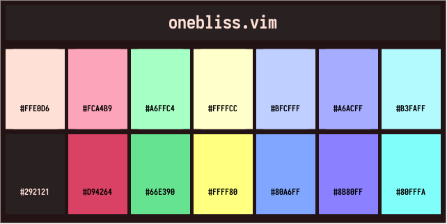

# This is still WIP.

# onebliss.vim

This was based off the impressive [onedark.vim](https://github.com/joshdick/onedark.vim) by joshdick. Thank you for the awesome syntax highlighting! The colour scheme was inspired after seeing co1ncidences' [bliss](https://github.com/co1ncidence/bliss).

I saw bliss and thought, this looks nice. However, the syntax highlighting was not as complete as onedark (daily driver colourscheme).

# Colours

