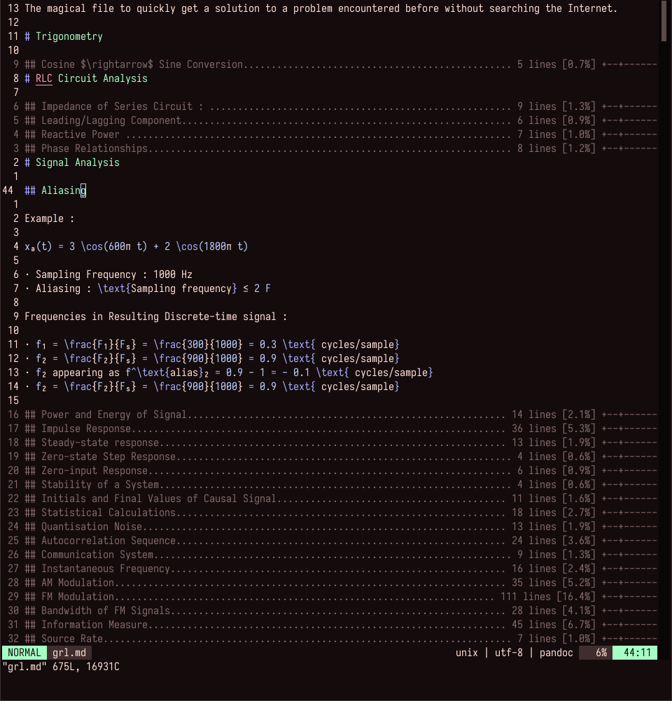
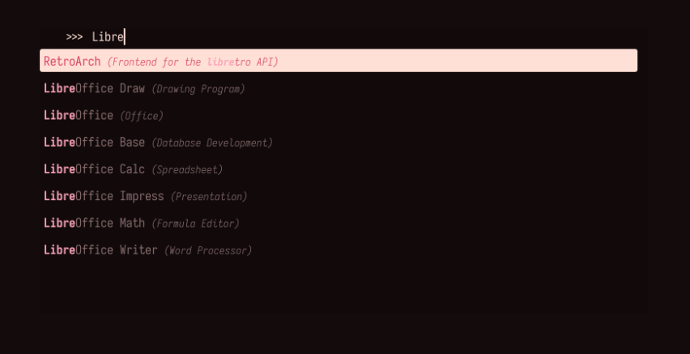

# onebliss.vim

A theme exactly the same as onedark but red.

This was based off the impressive [onedark.vim](https://github.com/joshdick/onedark.vim) by joshdick. The colour scheme was inspired after seeing co1ncidences' [bliss](https://github.com/co1ncidence/bliss).

Probably not the best idea for readability but it looks nice.

Colours were changed from bliss to have a bit of variation and a darker background to suit my work flow.

Includes :
- Rofi theme
- gtk theme (Made with Oomox)
- i3 colours
- alacritty colours

# Preview

Some engineering notes that I read on a daily basis.



.vimrc to flex the nice colours.


Some Rofi goodness.



GTK Theme


# Colours


# i3 Colours

```bash
# ----------------------------------------------------------------------------------------------------
#                                       Customisations
# ----------------------------------------------------------------------------------------------------
# Colour Scheme for i3
# class                 border  bground text    indicator child_border
client.focused          #fca4b9 #140b0c #ffe0d6 #140b0c   #fca4b9
client.focused_inactive #3f3333 #140b0c #ffe0d6 #140b0c   #3f3333
client.unfocused        #3f3333 #140b0c #806767 #140b0c   #806767
client.urgent           #140b0c #d94264 #ffe0d6 #d94264   #d94264
client.placeholder      #140b0c #140b0c #ffe0d6 #140b0c   #140b0c

client.background       #140b0c

bar {
    status_command SCRIPT_DIR=~/.config/i3blocks/blocklets i3blocks
    colors {
        background #140b0c
        statusline #ffe0d6
        separator  #ffe0d6

        focused_workspace  #ffe0d6 #140b0c #ffe0d6
        active_workspace   #140b0c #140b0c #ffe0d6
        inactive_workspace #140b0c #140b0c #ffe0d6
        urgent_workspace   #140b0c #d94264 #140b0c
        binding_mode       #140b0c #d94264 #140b0c
    }
}
```

# Credits
- [Josh Dick](https://github.com/joshdick) - For the amazing syntax highlighting and onedark.vim
- [co1ncidence](https://github.com/co1ncidence) - For the colour scheme inspiration for bliss
- [Belleve Invis](https://github.com/be5invis) - For the font Iosevka
